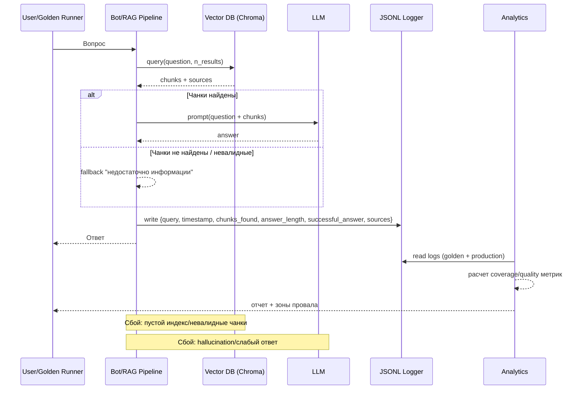

# Задание 7: Аналитика покрытия и качества базы знаний

Этот набор скриптов закрывает все пункты задания:

- внесение искусственных пробелов в базе знаний;
- логирование запросов к боту;
- golden set из 10-15 вопросов;
- автопрогон и оценка корректности;
- анализ логов и выявление проблемных тем.

## 1) Искусственные пробелы

Скрипт `simulate_gaps.py` переносит 3 ключевые сущности из `2_knowledge_base/knowledge_base` в `7_analytics/gaps_backup`:

- `Цирюльник (Оксенфурт).md`
- `Купец (торговец рыбой).md`
- `Шеймус Хольт.md`

Запуск:

```bash
python 7_analytics/simulate_gaps.py
```

Восстановление:

```bash
python 7_analytics/simulate_gaps.py --restore
```

После удаления/восстановления обнови индекс:

```bash
bash 6_autoupdate/autoupdate.sh
```

## 2) Логирование запросов бота

В `5_evil_docs/bot.py` добавлено логирование каждого запроса в `5_evil_docs/query_logs.jsonl` с полями:

- `query_text`
- `timestamp`
- `chunks_found`
- `answer_length`
- `successful_answer`
- `sources`

## 3) Golden set

Файл `golden_set.json` содержит 12 вопросов:

- 8 вопросов на известные темы (`should_answer=true`);
- 4 вопроса на удаленные/отсутствующие темы (`should_answer=false`).

## 4) Автоматическое тестирование

Скрипт `run_golden_tests.py`:

- задает вопросы по очереди;
- делает retrieval из ChromaDB;
- формирует ответ (LLM или fallback режим);
- сохраняет логи в `7_analytics/logs/golden_run_*.jsonl`;
- считает accuracy/recall/rejection-rate и пишет отчет в `7_analytics/reports/golden_report_*.json`.

Запуск (без LLM, быстрый режим):

```bash
python 7_analytics/run_golden_tests.py
```

Запуск с локальной LLM (LM Studio):

```bash
RUN_LLM=1 LLM_BASE_URL=http://localhost:1234/v1 LLM_API_KEY=lm-studio python 7_analytics/run_golden_tests.py
```

## 5) Анализ логов

Скрипт `analyze_logs.py` анализирует:

- последний golden run;
- пользовательские логи из `5_evil_docs/query_logs.jsonl`.

Формирует `7_analytics/reports/analytics_summary.json`:

- темы, где чаще всего ошибки;
- топ нерелевантных источников;
- долю запросов без чанков;
- долю неуспешных ответов.

Запуск:

```bash
python 7_analytics/analyze_logs.py
```

## Диаграмма последовательности


